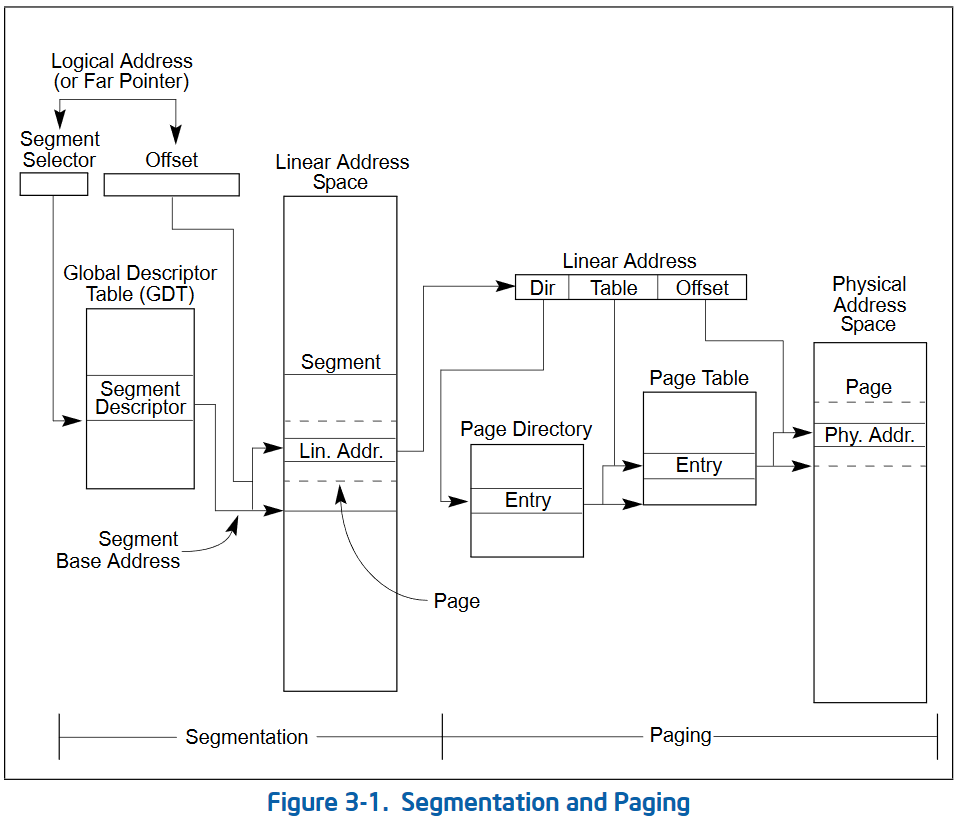
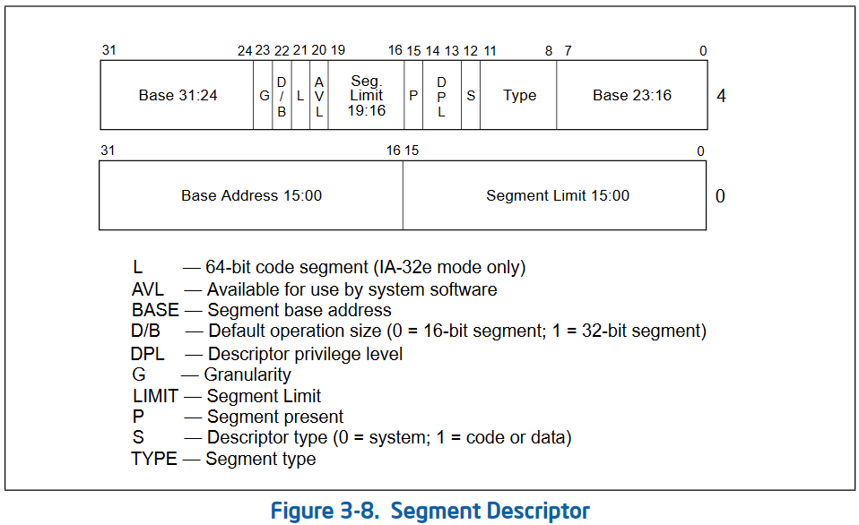
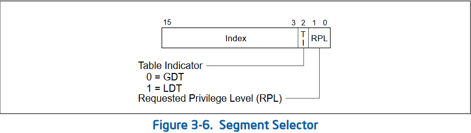

# GDT

## GDTとは

Grobal (Segment) Descriptor Tableの略称。

OSのメモリ管理においてセグメンテーションという方式がある。
物理メモリをセグメントと呼ばれる単位に切り分けて管理する方法で、そのセグメントを管理するためのテーブルがGDTである。

x64ではセグメンテーションは使われておらず、代わりにページングと呼ばれるメモリ管理方式を用いてメモリを管理している(実はx86時代もLinuxやWindowsはセグメンテーションを使っていない。はりぼてOSはかなり特殊といえよう)。

じゃあいらないかというとそうでもなく、CPU内部のセグメンテーションを処理する回路を無効にできないため、初期化作業はいまだに必要である。

## セグメンテーションに関連するレジスタ群

- CS, SS, DS, ES, FS, GS
    - セグメントレジスタと呼ばれるレジスタたち。16bit長。
    - GDT/IDTのどちらかで、テーブルの何番目を指すのか、権限レベルはどうなのかといったことを指定するために用いる。
- GDTR
    - GDTのベースアドレスとリミットを指定するレジスタ。64bitモードでは79bit長。

## 64-bitモードのセグメンテーションのフロー

全体像から見よう。以下の図がx64のメモリ管理の概観である。

ページングと一緒になっているのでややこしいが、ここではセグメンテーションの部分だけ見よう。

### GDT 

まずGDTであるが、これは以下のようなビット列が連なったテーブルである。

重要なのはBaseとSegment Limitである。セグメンテーションではメモリをセグメントという単位で分割するが、Baseというのはそのセグメントが開始するアドレスである。一方Segment Limitというのはそのセグメントの長さである。例えば、Base = 0x7c00, Segment Limit = 0x100とすると、そのセグメントは0x7c00 ～ 0x7d00の範囲である。

x64ではセグメンテーションが使われていないといったが、これはセグメントの指定を、メモリ全体を指すように設定することで実質無効化するということを言っている。また、Segment Limitは64-bitモードでは無視される。つまり、Base = 0に設定して、メモリ全てを包むセグメントを作ることで、セグメントではメモリを区切らない(1つに区切るともいえる)ようにしている。

また上の図ですべての要素が0のディスクリプタをNull Descriptorという。

GDTの先頭はNull Descriptorにしないといけないお約束がある。またセグメントには権限を設定することもできる。

これらから、私たちが用意すべきディスクリプタは以下の三つである。

1. Null Descriptor
2. 権限0(カーネルモード)でメモリをすっぽり覆うセグメントを表すディスクリプタ
3. 権限3(ユーザーモード)でメモリをすっぽり覆うセグメントを表すディスクリプタ

### セグメントレジスタ

セグメントレジスタであるが、CS以外は無効化あるいは0として扱われるので気にしなくてよい。

CSであるが、以下の図を見ながら解説する。

